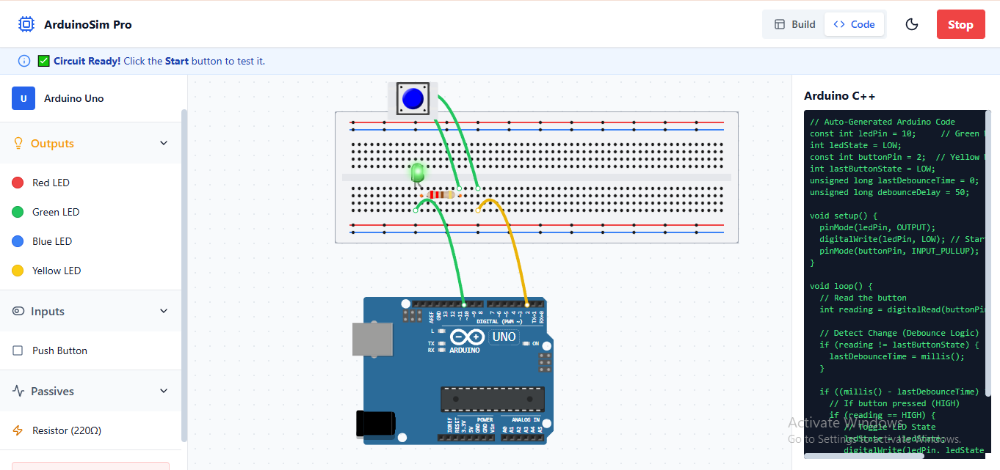

# ⚡ Arduino Simulator Pro

A modern, web-based Arduino simulator built with **React**, **Vite**, and **Tailwind CSS**. This tool allows users to build virtual circuits using a drag-and-drop interface, wire components together, and simulate real-time logic with automatic C++ code generation.



## 🚀 Features

* **🛠️ Drag & Drop Interface:** Easily place components like Arduino Uno, LEDs, Resistors, and Push Buttons from the categorized sidebar library.
* **🔌 Smart Wiring:** Draw realistic curved wires between pins. Wires automatically adjust to sit "behind" components for a clean look.
* **💡 Real-Time Simulation:**
    * **Interactive Controls:** Click push buttons to toggle LEDs using realistic latching logic.
    * **Circuit Validation:** The simulation only runs if the circuit is fully connected (power and signal wires).
* **📝 Auto-Code Generation:** Instantly generates valid **Arduino C++ code** that mirrors your virtual circuit configuration.
* **🎨 Realistic UI:**
    * **Smart Layering:** Wires appear "behind" push buttons and "on top" of Arduino pins for a 3D-like effect.
    * **Interactive Hints:** Context-aware hints guide you through the building process.
    * **Dark/Light Mode:** Fully responsive theme toggling.

## 🛠️ Tech Stack

* **Frontend:** React.js + Vite
* **Styling:** Tailwind CSS
* **Icons:** Lucide React
* **Drag & Drop:** `react-draggable`

## 📦 Installation & Setup

1.  **Clone the repository:**
    ```bash
    git clone [https://github.com/Kartikay-goel/Arduino-Simulator-Pro.git](https://github.com/Kartikay-goel/Arduino-Simulator-Pro.git)
    cd Arduino-Simulator-Pro
    ```

2.  **Install dependencies:**
    ```bash
    npm install
    ```

3.  **Run the development server:**
    ```bash
    npm run dev
    ```

4.  **Open in Browser:**
    Navigate to `http://localhost:5173` to start simulating!

## 🎮 How to Use

1.  **Build:** Open the **Build** tab and drag an **Arduino**, **LED**, **Resistor**, and **Push Button** onto the canvas.
2.  **Wire:** Click on a component pin to start a wire, then click on another pin to connect them.
    * *Tip: Connect Arduino Pin 10 to the LED and Pin 2 to the Button.*
3.  **Code:** Switch to the **Code** tab to see the auto-generated C++ code.
4.  **Simulate:** Click the **Start** button in the header.
    * Press the Push Button to test the circuit!

## 🤝 Contributing

Contributions are welcome! Feel free to submit a Pull Request.

## 📄 License

This project is open-source and available under the [MIT License](LICENSE).
